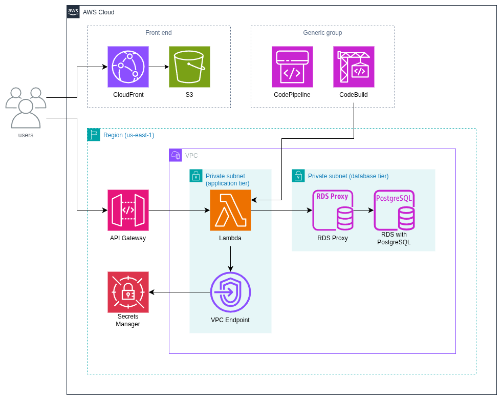

# placey-infra

Terraform infrastructure as code for the Placey system. Provisions and manages all AWS cloud resources for the `dev` environment.

## What is Placey?

Placey is a proximity-based application that helps users discover nearby recreational places based on their current location. It is built as an educational MVP for a System Design course.

## Polyrepo Architecture

Placey is split across three repositories:

| Repository        | Responsibility                                            |
| ----------------- | --------------------------------------------------------- |
| `placey-infra`    | Terraform IaC - all AWS resource provisioning (this repo) |
| `placey-backend`  | Lambda functions, REST API, geospatial queries            |
| `placey-frontend` | React app, map UI, search interface                       |

Each repo is independently deployable. No shared code between repos.

## AWS Architecture



- **Frontend:** CloudFront, S3 (static React app).
- **Backend:** API Gateway, Lambda (Node.js 24.x), RDS Proxy, PostgreSQL 16 with PostGIS.
- **Networking:** VPC with private subnets, VPC Endpoint for Secrets Manager.
- **Security:** Secrets Manager, Security Groups, IAM roles.

All resources are provisioned in `us-east-1`.

## Documentation

- [`docs/infrastructure-spec.md`](docs/infrastructure-spec.md): full infrastructure specification
- [`docs/aws-console-guide.md`](docs/aws-console-guide.md): step-by-step AWS Console provisioning guide

## Deployment

This deployment uses Terraform to provision the full infrastructure. For a manual alternative, see the [AWS Console Guide](docs/aws-console-guide.md) for a step-by-step walkthrough through the AWS Console.

### Prerequisites

- [Terraform](https://developer.hashicorp.com/terraform/install) `~> 1.12`
- [AWS CLI](https://docs.aws.amazon.com/cli/latest/userguide/install-cliv2.html) configured with credentials

### Deploy

1. Initialize Terraform:

    ```sh
    terraform -chdir=environments/dev init
    ```

2. Preview the changes:

    ```sh
    terraform -chdir=environments/dev plan -var-file=dev.tfvars
    ```

3. Apply:

    ```sh
    terraform -chdir=environments/dev apply -var-file=dev.tfvars
    ```

To view outputs at any time:

```sh
terraform -chdir=environments/dev output
```

### Deploy Lambda Code

Once the infrastructure is provisioned, deploy the Lambda functions from the [`placey-backend`](https://github.com/mrcarpinchoo/placey-backend) repository. See the backend deploy guide for instructions.

### Cleanup

To tear down all infrastructure:

```sh
terraform -chdir=environments/dev destroy -var-file=dev.tfvars
```

### State

Terraform state is stored locally at `environments/dev/terraform.tfstate`. This file is gitignored; do not commit it.

## Authors

Developed as part of a System Design course - Team 4.
